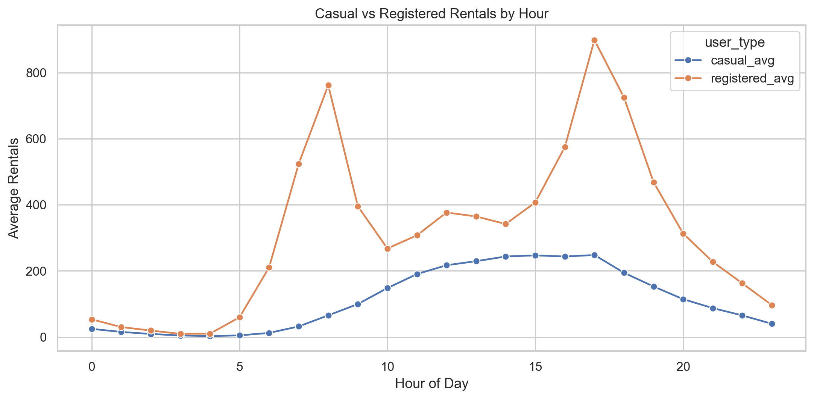
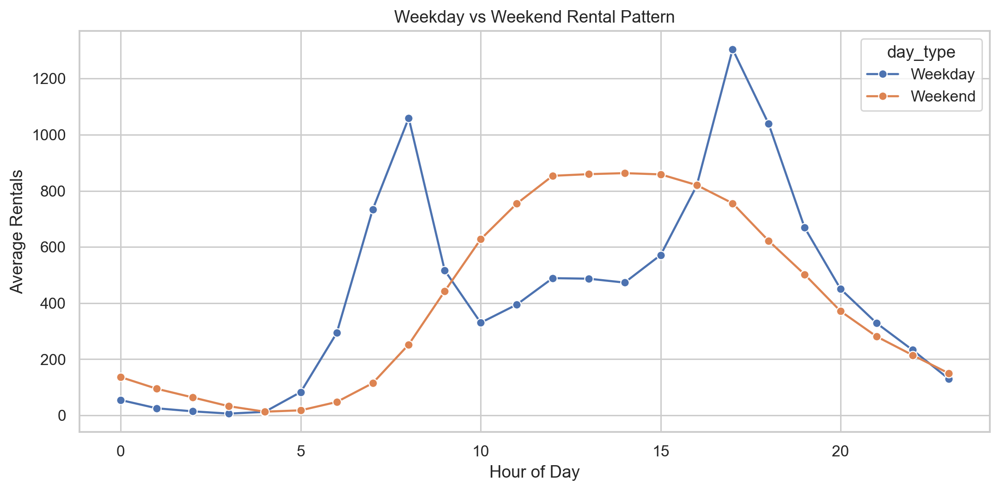
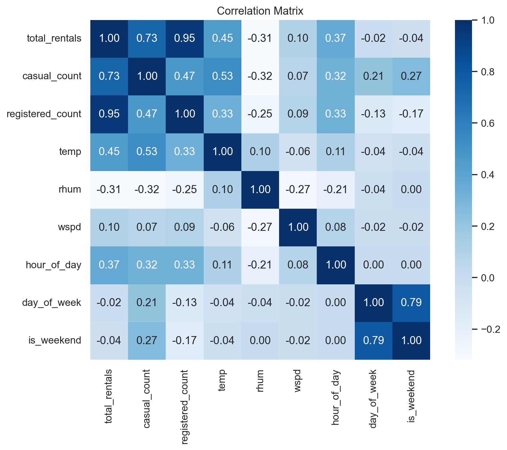
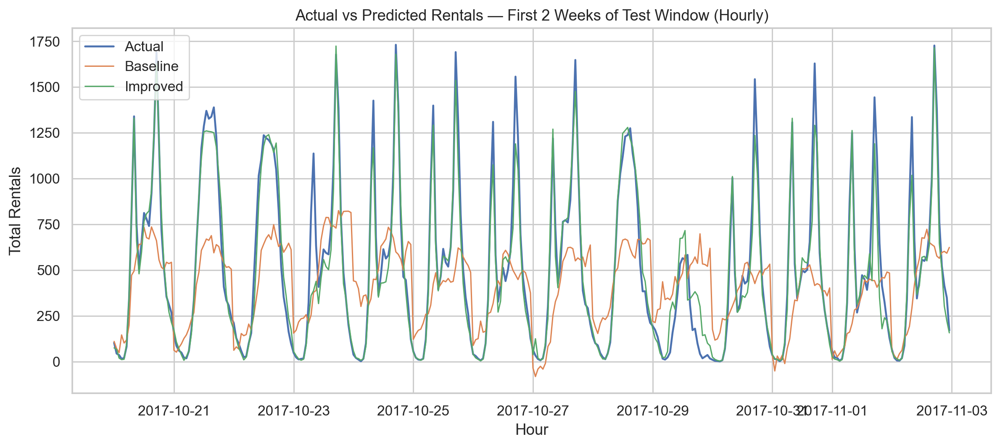
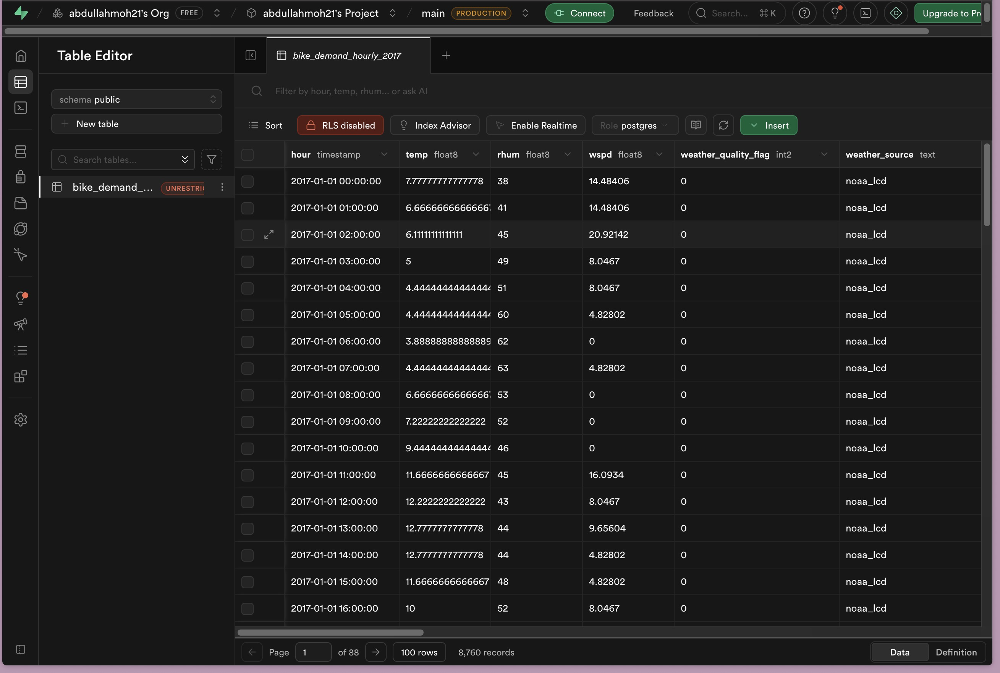

# Bike Sharing Demand and Weather Analysis

**Published:** [GitHub Repository](https://github.com/abdullahmoh21/bike_analysis)

## Dataset

**Source:** [Capital Bikeshare System Data (2017)](https://s3.amazonaws.com/capitalbikeshare-data/index.html)

Capital Bikeshare publishes anonymized trip history for every ride taken on the D.C. bike-share network. This project uses the four 2017 quarterly CSV files (~3.4 million trips), each containing a trip start timestamp and rider membership type (casual or registered/member).

**License:** [Capital Bikeshare Data License Agreement](https://capitalbikeshare.com/data-license-agreement). Data is made available for non-commercial use. No personally identifiable information is included.

**Weather:** Hourly observations for Washington D.C. sourced from the [NOAA Local Climatological Data (LCD)](https://www.ncei.noaa.gov/products/land-based-station/local-climatological-data) for Reagan National Airport (Station WBAN 13743, 2017). Downloaded as CSV and stored at `raw/2017-DC-Hourly-Weather.csv`. As a product of the U.S. federal government, NOAA data is in the public domain under [17 U.S.C. § 105](https://www.copyright.gov/title17/92chap1.html#105) and is free to use without restriction.

## Analytics Question

> **Can we predict hourly bike rental demand in Washington D.C. using weather conditions and time-of-day features, and how much does rider type (casual vs. registered) differ in their sensitivity to weather and time?**

This addresses two sub-questions:
1. Which factors (temperature, humidity, wind, hour, day type) most strongly predict total hourly demand?
2. Do casual and registered riders respond differently to these factors — and does that difference influence which features matter most in a predictive model?

## Tools Used

| Tool | Role |
|---|---|
| Python (pandas, scikit-learn, matplotlib, seaborn) | ETL, EDA, modeling, visualization |
| PostgreSQL / AWS RDS alternative cloud RDS (Supabase) | Storage and querying of cleaned dataset |
| SQL (psql / SQLAlchemy) | Schema definition, index creation, analysis queries |

## Project Structure

```
bike_analysis/
  raw/                                  # Raw input data (included in repo)
    2017-capitalbikeshare-tripdata/     # Quarterly trip CSVs
    2017-DC-Hourly-Weather.csv          # NOAA LCD hourly weather
  data/                                 # Generated: cleaned hourly master dataset
  outputs/
    figures/                            # Generated: all charts (PNG)
    models/                             # Generated: trained .joblib model files
    tables/
      pipeline/                         # data_quality_report.json, column_detection_log.json
      eda/                              # CSV summaries from EDA
      modeling/                         # model_metrics, predictions, feature importance
  sql/
    create_hourly_table.sql             # PostgreSQL schema + indexes
    analysis_queries.sql                # Example queries demonstrating queryability
  src/
    pipeline.py                         # ETL: load trips → join weather → engineer features
    eda.py                              # Exploratory Data Analysis
    modeling.py                         # Train baseline + improved models
  run.py                                # One-command runner: ETL → EDA → Modeling
  data_dictionary.md                    # Field descriptions for all columns in master dataset
  requirements.txt
  .env.example
```

## Reproducing Results

### 0. Prerequisites

Python 3.9+, pip, and (optionally) a PostgreSQL instance with `DATABASE_URL` set in `.env`.

### 1. Clone the repo

```bash
git clone https://github.com/abdullahmoh21/bike_analysis.git
cd bike_analysis
```

Raw trip CSVs and weather data are already included in `raw/`. If you want to validate the source data yourself, the original files are available at the [Capital Bikeshare trip history page](https://s3.amazonaws.com/capitalbikeshare-data/index.html) and [NOAA LCD](https://www.ncei.noaa.gov/products/land-based-station/local-climatological-data) (Reagan National, station WBAN 13743, 2017).

### 2. Set up the environment

```bash
python3 -m venv .venv
source .venv/bin/activate
pip install -r requirements.txt
cp .env.example .env   # edit DATABASE_URL if loading to PostgreSQL
```

### 3. Run the full pipeline

```bash
python run.py
```

This runs all three stages in order: ETL → EDA → Modeling. To also load the cleaned dataset into PostgreSQL, pass `--load-db`:

```bash
python run.py --load-db
```

Requires `DATABASE_URL` in `.env`. The table `bike_demand_hourly_2017` will be created (or replaced) automatically.

#### What each stage does

**ETL (`src/pipeline.py`)**
- Aggregates ~3.4 M raw rides to hourly counts (`casual_count`, `registered_count`)
- Loads NOAA LCD weather from `raw/2017-DC-Hourly-Weather.csv`, filters to FM-15 (routine METAR) reports, converts °F → °C and mph → km/h
- LEFT JOINs bike counts onto the full 8,760-hour timeline (hours with no rides become zero)
- Engineers features: `season`, `season_code`, `is_weekend`, `time_of_day`, `holiday`, `workingday`, `atemp` (apparent temperature)
- Tags weather quality: 0 = observed, 1 = interpolated, 2 = ffill/bfill, 3 = median fill
- Writes `outputs/tables/pipeline/data_quality_report.json` and `column_detection_log.json`

**EDA (`src/eda.py`)**
- Outputs CSV summaries to `outputs/tables/eda/`
- Outputs PNG charts to `outputs/figures/`

**Modeling (`src/modeling.py`)**
- Chronological 80/20 train/test split with TimeSeriesSplit cross-validation (5 folds)
- Baseline: Linear Regression; Improved: Random Forest (300 estimators)
- Outputs to `outputs/tables/modeling/` and `outputs/figures/`

Model artifacts:
- `outputs/models/baseline_linear_regression.joblib`
- `outputs/models/improved_random_forest.joblib`
- `outputs/tables/modeling/model_metrics.json` / `.csv`
- `outputs/tables/modeling/test_predictions.csv`
- `outputs/tables/modeling/model_residuals.csv`
- `outputs/tables/modeling/random_forest_feature_importance.csv`

#### Running stages individually

```bash
python src/pipeline.py --trip-dir raw/2017-capitalbikeshare-tripdata --year 2017 --output-csv data/hourly_bike_weather_2017.csv
python src/eda.py --input-csv data/hourly_bike_weather_2017.csv
python src/modeling.py --input-csv data/hourly_bike_weather_2017.csv
```

Schema and indexes: `sql/create_hourly_table.sql`
Example analysis queries: `sql/analysis_queries.sql`

## Key Findings

- Registered riders show a sharp bimodal peak at commute hours (8 AM, 5–6 PM) on weekdays; casual riders peak midday on weekends — this difference motivated keeping `time_of_day` and `is_weekend` as separate features in the improved model.
- Temperature is the strongest single weather predictor (correlation ~0.4 with total rentals); humidity is negatively correlated.
- The Random Forest improved on the Linear Regression baseline substantially (see `outputs/tables/modeling/model_metrics.json` for exact numbers), with `hour_of_day` and `atemp` as the top two features by importance.

## Charts

**Casual vs Registered Rentals by Hour**


**Weekday vs Weekend Rental Pattern**


**Correlation Matrix**


**Model: Actual vs Predicted (Chronological Test Window)**


## Cloud Database

Data loaded into a cloud-hosted PostgreSQL instance (Supabase) via the pipeline's `--load-db` flag.



## Limitations & Next Steps

**Limitations:**
- Only weather and time features are used; event data (concerts, protests, holidays beyond federal) could improve predictions.
- 2017 is a single year — seasonal patterns may differ across years.
- Weather is from a single airport station and may not reflect conditions across all D.C. neighborhoods.

**Next steps:**
- Incorporate station-level data (which docks are full/empty) for spatial analysis.
- Extend to multiple years to test model generalizability.
- Add real-time prediction via a lightweight API wrapper around the trained model.

## Notes

- The pipeline reads trip CSVs in 500,000-row chunks for memory efficiency.
- Column name detection is fuzzy to handle header differences across quarterly files.
- This project focuses on weather/time features and does not include event metadata.
